# Wishlist Documentation

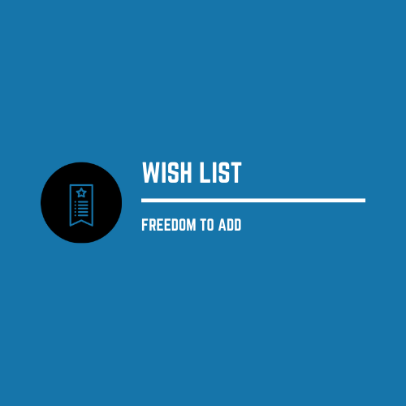

 <i><small>moto: </small> " Wish List - the freedom to add anything you wish " </i>

## Introduction

It is a mobile application or software which allow user to store list of items with its location price and Image. It helps user to remember something which they will buy in future. It is like inventory software which stores essential products details where it available so user can buy when it has resources like system shown in today’s RPG Games.

## Main Screen

		a) 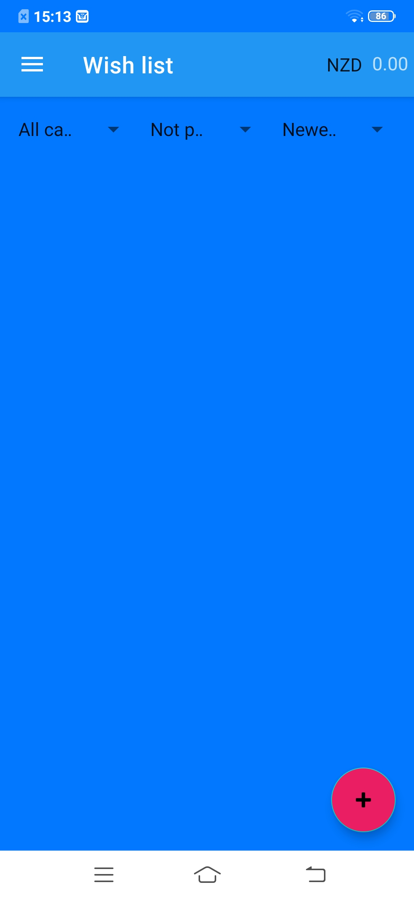
		b) 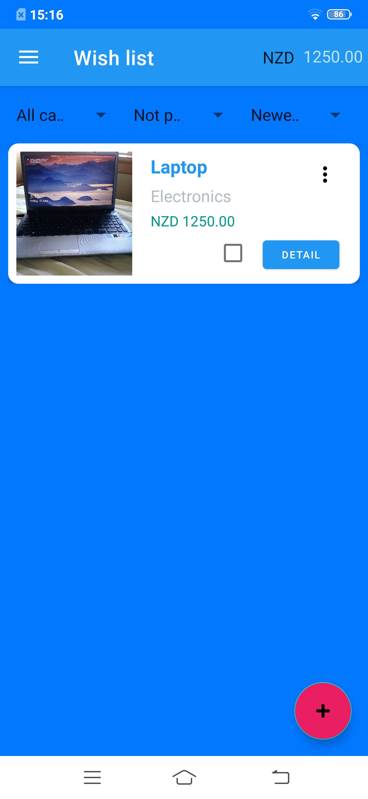

 <strong>Figure 1.1</strong><em> a) Empty Main Screen b) Screen Filled with needed item </em> 

In figure 1.1, you can see there is two screen of Wishlist. in first screen you can see empty screen with no item needed and second screen you can see the needed item in wishlist.

### So basically, applications includes minimal functionalities which shown below:

- Show remain items with picture which need to buy to fullfill project or Goal
- Show detailed information of remain items.
- Add new item which is need to complete quest or objective or goal
- View and filter wishlist item bases on category, not purchased, Newest added sorting
- For extras, app allows us to stop notiftion for remain items.
- Application shows how much you spent on your wishes.

## Intro To Main Screen

		

<strong>Figure 1.2:</strong> <emp>Details of MainScreen</emp>

	When you seen carefully, you got so many things in application so lets start point by point.

- On top, you can see total is displayed. it is total of all filtered items of application.
- On topleft corner, <emp>"NZD"</emp> is displayed which shows currency of items in wishlist. if you want to change currency, just tap on whatever currency displayed and you will get options to change currency.
- In middle of screen, you will see titles with arrows, those are filters used to filtering items. when you click on arrow it shows available filter options such as when you click on category, it will ask you which category you want to filter out.
- Main thing is added item displayed on wishlist which is displayed as white card. it provide abstract details of item and option called "details" used to see more specific details.
- There is more menu on white card which allow you to edit and delete items. besides of it, there is checkbox which reflect item is bought if it is checked
 - Last important thing is cool red hover button. however application is useless if you are not able add or input something so it is allow you add new item in your wishlist application.

 ## Focus on Add new item to WishList

	a) 
	b) 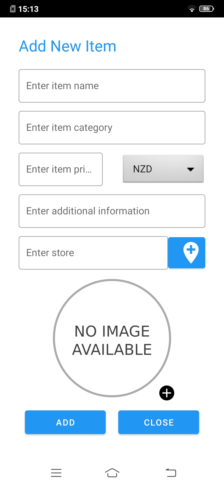
	c) 

	<strong>Figure 1.3 :-</strong><emp> a)MainScreen b)Add New Item Page c) Item Added to List</emp>

 Steps:-

 1. Open Application and you see blank screen if you first time as Figure 1.3 a)
1. Click on red hover button on bottom right corner as shown in Figure 1.3 a)
1. After click on button, you will see form to add item as Figure 1.3 b)
1. Click on add and application return to main page and you can see item as Figure 1.3 c)

So it is processed to add single item to wishlist, for furture may we add import function if possible.

 ## Edit item

	a) 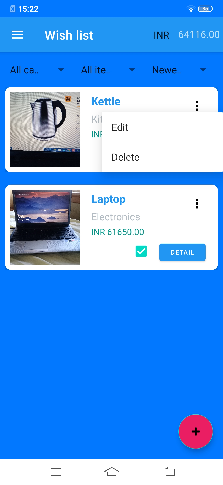
	b) 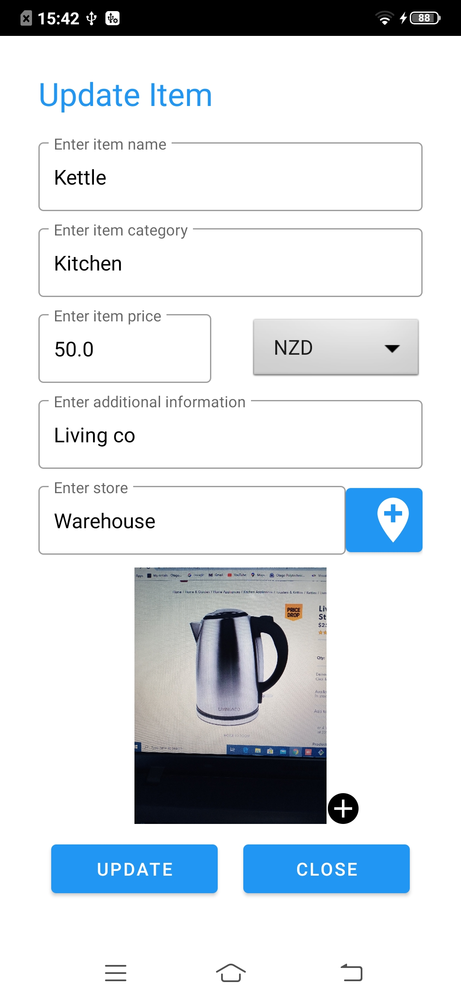

	<strong>Figure 1.4 :-</strong><emp> a)Edit popup menu b)Edit item dialog</emp>

 Steps:-

 1. Click more menu on the item Figure 1.4 a)
1. You will see update item screen as shown in Figure 1.4 b)
1. Item details will be updated

 ## Delete item

	a) 
	b) 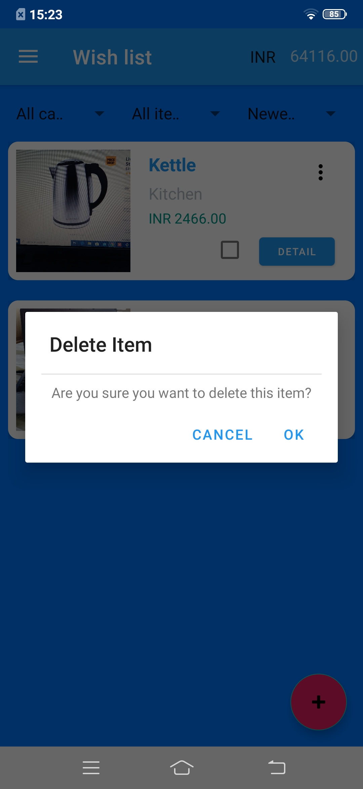

	<strong>Figure 1.5 :-</strong><emp> a)Popup menu b)Delete confirmation dialog</emp>

 Steps:-

 1. Click more menu on the item Figure 1.4 a)
1. Select delete option
1. Delete confirmation dialog will be displayed  1.4 b)
1. Once click Yes, item will be removed.

## Side Hover Menu

	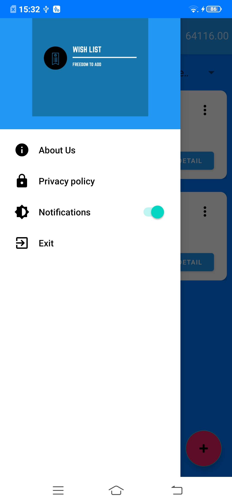

	<strong>Figure 1.6 :- </strong><emp>Side Hover Menu</emp>

	Here in figure 1.6 , you can see  side hover menu which includes AboutUs, Privacy Policy, Notification Toggler and Exit Option.

	You can disable notifications by switch off notifcation toggler shown in Side Hover Menu.

	About Us option displayed app owner's information such as Company Name, Designer Name, Developer Name.

	Privacy Policy option displays company's privacy terms and conditions of application.

## Filter Options

	a) 
	b) 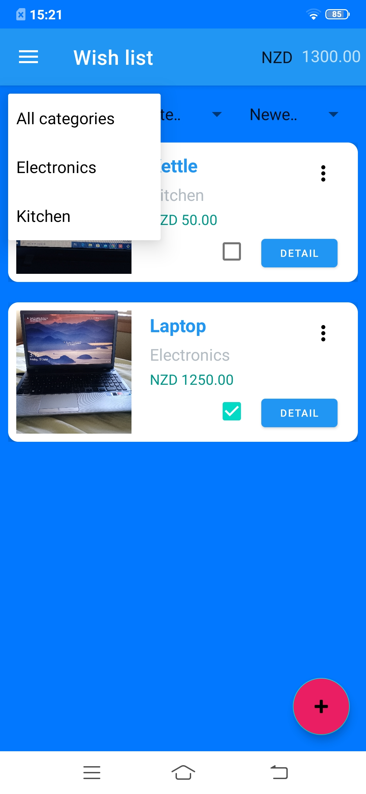
	c) 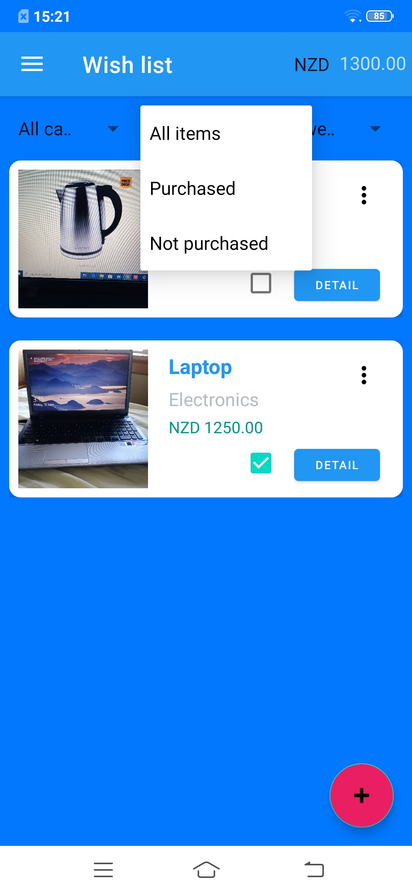
	d) 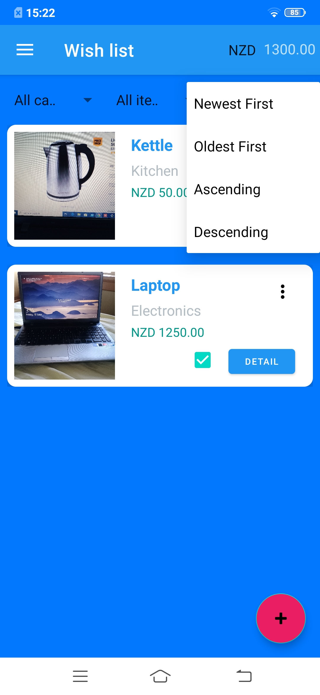
	e) 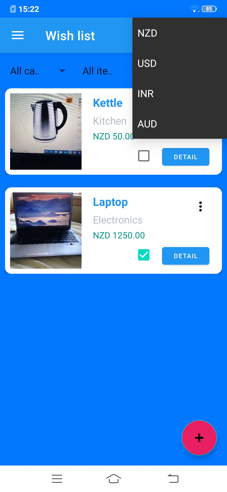

<strong>Figure 1.7:- </strong><emp>a) Non Filter b) Sorting Filter c) Purchased Filter d) Category Filter d) Currency Filter</emp> 

There are four major filters available in applications.

1. Sorting Filter
	1. Newest First - Last Item added shown first in wishlist.
	1. Oldest First - Very first item added shown first in wishlist.
	1. Ascending - Item showed in A to Z Manner.
	1. Decending  - Item Showed in Z to A Manner.
1. Purchased Filter
	1. Not Purchased - Item which need to be purchased is shown.
	1. Purchased - Item which is alread purchased.
1. Category Filter
	1. All Categories - Show all item belonging any category.
	1. Electronics(Based on what user add) - Show all item beloging to selected to category.
1. Currency Filter
	1. Displays drop down menu with currencies.
	1. Once currency is selected, then all items price will be updated to the selected currency.(Note: In database currencies won't be changed)

## Store selection in google map

	
	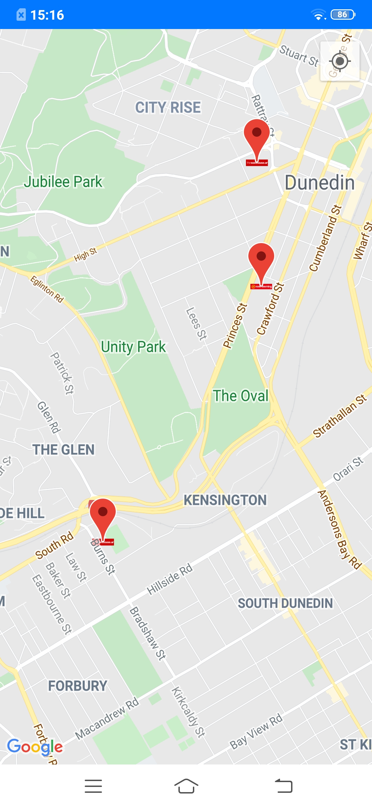

	<strong>Figure 1.8 :- </strong><emp>Store selection in Map</emp>

	When the user click on map icon first time, then permission request will be prompted to ON the map location.

	User can select the store in google map. There is red marker for stores. If user click on map other than the red marker, then message will appear as "Store not selected".

## Take pictures using camera

	

	<strong>Figure 1.9 :- </strong><emp>Take pictures on camera</emp>

	When the user click on add image icon first time, then permission request will be prompted give permission.

	User can take pictures using the camera. The pictures will be stored on external memory.

## Privacy policy

	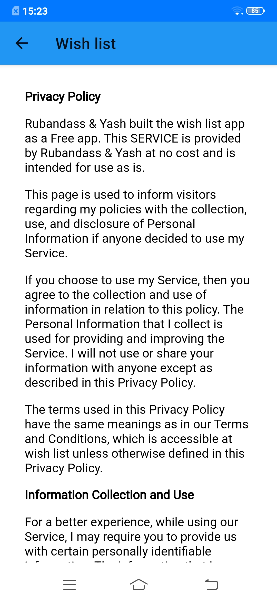

	<strong>Figure 2.0 :- </strong><emp>Privacy policy</emp>

	Privacy policy will be opened in web view format.

## About Us

	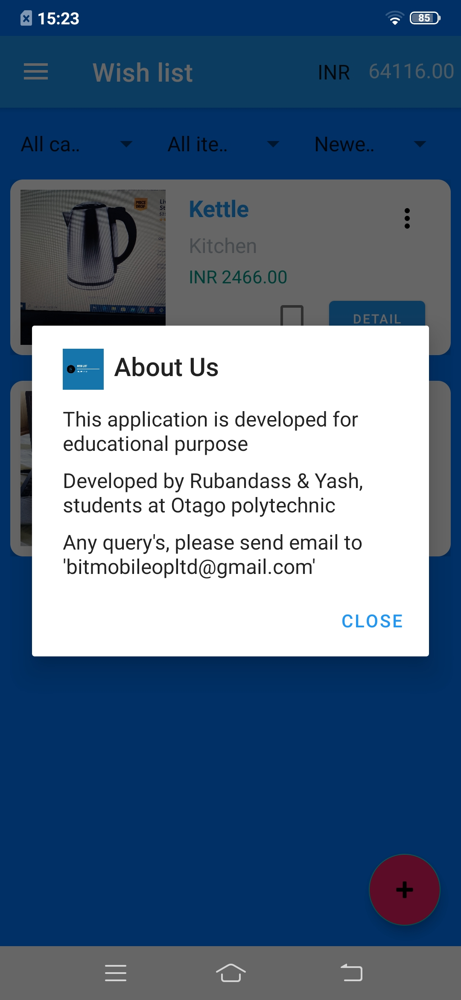

	<strong>Figure 2.1 :- </strong><emp>About dialog</emp>

	Displays basic information about the developers.

## Exit

	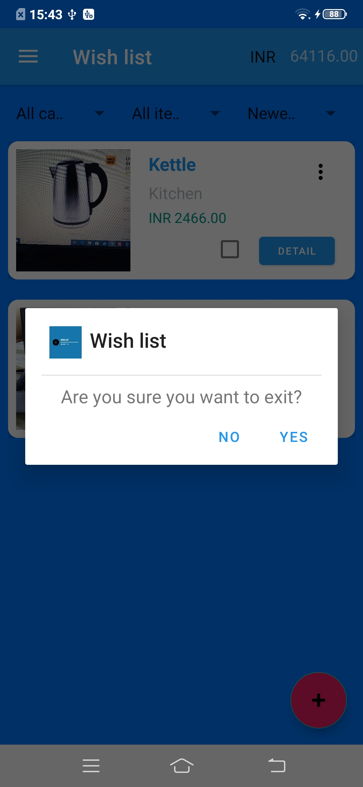

	<strong>Figure 2.2 :- </strong><emp>Exit dialog</emp>

	User will be prompted with exit alert dialog

